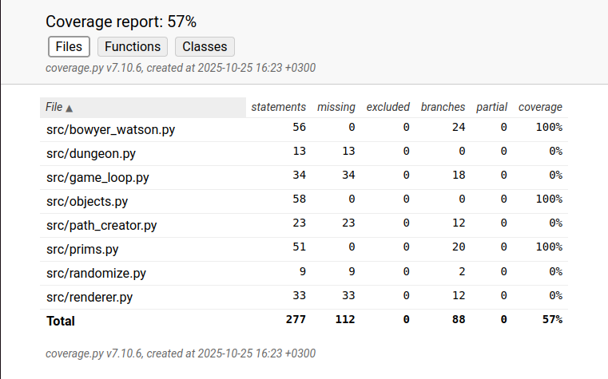

# Testausdokumentti
## Testikattavuus


## Testauksesta
Ykiskkötestit on tehty kaikille objekteille, sekä Bowyer-Watson- ja Primmin algoritmeille.

Yksikkötestit ajetaan komennolla:
```bash
poetry run invoke test
```
ja kattavuusraportin saa komennolla: 
```bash
poetry run invoke coverage-report
```

Ohjelmaa ei ole vielä testattu monimutkaisemmilla testeillä.